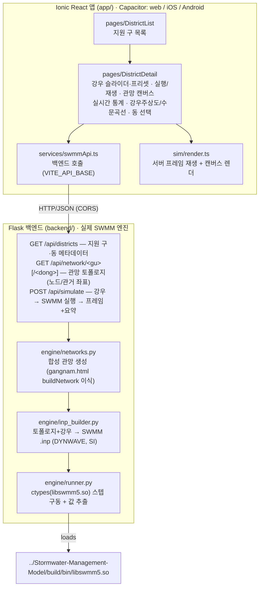

# 서울 침수 시뮬레이터 — SWMM 기반 강우-유출 침수 시연

서울 지역의 강우-유출에 따른 도시 침수를 **실제 EPA SWMM 5.2.4 엔진**으로 시뮬레이션하고,
**구(區)·동(洞) 단위**로 화면 보고하는 멀티플랫폼 앱 프로토타입입니다.

- **프론트엔드:** [Ionic](https://ionicframework.com/) + React (+ Capacitor → web / iOS / Android)
- **백엔드:** Flask REST API가 ctypes로 사용자가 직접 빌드한 `libswmm5.so`(실제 SWMM 동역학파
  엔진)를 구동
- **모델:** 구/동별 합성 우수관망을 절차적으로 생성(아래 *standalone* 데모의 방식 일반화),
  강우강도→관망 라우팅→과부하 월류(침수)를 실제 엔진으로 계산

> 현재 범위(프로토타입): **강남구 · 서초구 · 송파구** 3개 구 + 각 구의 대표 동 몇 개.
> 로드맵은 [범위 / 로드맵](#범위--로드맵) 참고.

---

## 구조



백엔드가 **토폴로지의 단일 소스**입니다. 동일한 생성기가 `.inp`와 `/api/network` 응답을 모두
만들기 때문에, 앱이 그리는 관망과 SWMM이 실제로 푼 모델이 항상 일치합니다.

실제 SWMM은 배치(batch) 엔진이므로 상호작용은 **실행 → 결과 재생** 방식입니다. 강우/구·동을
고르고 "실행"하면 백엔드가 전체 시뮬레이션을 돌려 시계열을 반환하고, 앱이 이를 애니메이션합니다.

---

## 사전 준비: SWMM 엔진 빌드

이 저장소는 SWMM 소스를 포함하지 않습니다. [USEPA/Stormwater-Management-Model]을 형제
디렉터리로 클론·빌드하여 `libswmm5.so`를 준비하세요.

```bash
git clone https://github.com/USEPA/Stormwater-Management-Model.git ../Stormwater-Management-Model
cd ../Stormwater-Management-Model && mkdir -p build && cd build
cmake .. && cmake --build .
# 결과: build/bin/libswmm5.so , build/bin/runswmm
```

백엔드는 기본적으로 `../Stormwater-Management-Model/build/bin/libswmm5.so`를 찾습니다.
다른 위치라면 환경변수 `SWMM_LIB`로 절대경로를 지정하세요.

[USEPA/Stormwater-Management-Model]: https://github.com/USEPA/Stormwater-Management-Model

---

## 백엔드 실행 (Flask + 실제 SWMM)

Python 3.10+ 가상환경에 의존성을 설치합니다.

```bash
cd backend
python -m venv .venv && source .venv/bin/activate   # 또는 기존 venv 사용
pip install -r requirements.txt
# 필요 시: export SWMM_LIB=/abs/path/to/libswmm5.so
python app.py          # http://127.0.0.1:5057
```

빠른 점검:

```bash
curl http://127.0.0.1:5057/api/health
curl -X POST http://127.0.0.1:5057/api/simulate \
  -H 'Content-Type: application/json' \
  -d '{"gu":"gangnam","rain_mm_h":110}'
```

---

## 앱 실행 (Ionic React)

Ionic은 npm 의존성으로만 설치되며 저장소에 포함되지 않습니다(`node_modules/`는 git 제외).

```bash
cd app
npm install
npm run dev            # http://127.0.0.1:5173  (Vite 개발 서버)
```

백엔드 주소는 `app/.env`의 `VITE_API_BASE`로 설정합니다(기본 `http://127.0.0.1:5057`).
브라우저에서 열어 구를 선택하고, 강우강도를 고른 뒤 **시뮬레이션 실행**을 누르세요.
관거가 차오르고 과부하 노드가 침수(붉은 맥동)로 표시되며, 수문곡선이 그려집니다.

### 네이티브 빌드 (Capacitor, 선택)

```bash
cd app
npm run build
npx cap add android    # 또는: npx cap add ios   (Android SDK / Xcode 필요)
npx cap sync
npx cap open android
```

> 안드로이드 에뮬레이터에서 호스트의 백엔드에 접속하려면 `VITE_API_BASE`를
> `http://10.0.2.2:5057`로 바꿔 빌드하세요. 네이티브 패키징 시에는 백엔드를 접근 가능한
> 호스트에 배포해야 합니다.

---

## 레거시 standalone 데모 (알고리즘 참고용)

저장소 루트의 두 단일 HTML 파일은 SWMM 동역학파 라우팅을 **브라우저에서 직접 구현**한
초기 데모입니다. 서버·의존성 없이 더블클릭으로 실행되며, 백엔드 합성 관망 생성기의 원형입니다.

- `index.html` — 시연용 소규모 배수분구 1개(7노드)
- `gangnam.html` — 강남구 기반 ~100노드 절차 생성 관망 (`engine/networks.py`가 이를 이식)

이들은 실제 SWMM 엔진이 아니라 *알고리즘*만 재현합니다. 실제 엔진은 위의 백엔드가 구동합니다.

---

## 범위 / 로드맵

**현재 (프로토타입)**
- 3개 구(강남·서초·송파) + 구별 대표 동, 합성 관망
- 웹 타깃 end-to-end 동작, Capacitor 네이티브 스캐폴딩 완료
- 실제 SWMM 5.2.4 동역학파, SI 단위, 강우강도 0~180 mm/h

**다음**
- 서울 25개 구 전체로 확장, 실제 행정경계 GeoJSON + 배수구역 GIS 연동
- 오프라인 동작을 위한 SWMM WebAssembly 빌드(서버리스)
- 강우 시나리오(시간가변 호우주상도), 배수펌프/저류조 등 시설 모델링
- **양자 최적화**: 펌프·저류시설 배치/운영 등 조합최적화에 Qiskit 적용(별도 작업)

---

## 디렉터리

```
backend/
  app.py                Flask API
  requirements.txt
  engine/
    networks.py         서울 구/동 합성 우수관망 생성
    inp_builder.py      SWMM .inp 생성 (DYNWAVE, 미터법)
    runner.py           ctypes libswmm5.so 구동 → 프레임/요약
app/
  src/
    pages/              DistrictList, DistrictDetail
    services/swmmApi.ts API 클라이언트
    sim/render.ts       캔버스 렌더 + 프레임 재생
    theme/variables.css 다크 테마
  capacitor.config.ts   멀티플랫폼 설정
index.html, gangnam.html  레거시 standalone 데모
```

알고리즘 출처: [USEPA/Stormwater-Management-Model] `src/solver/dynwave.c`
